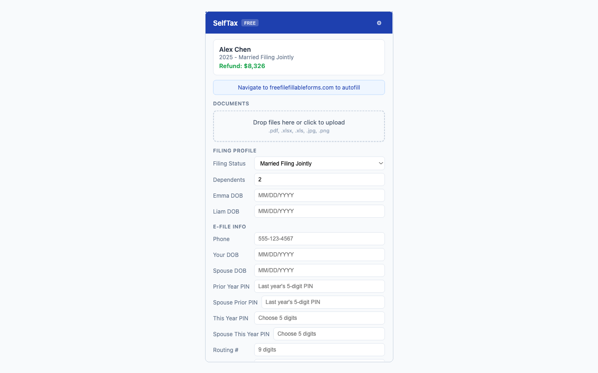
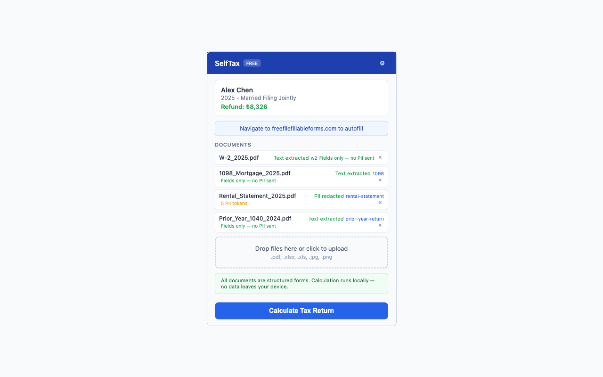
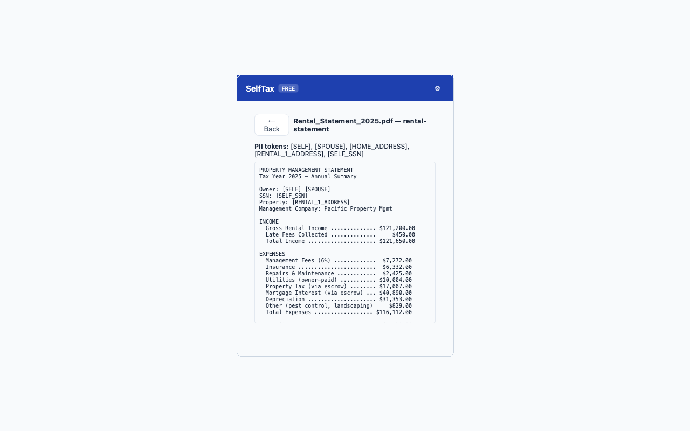

# SelfTax — Free AI-Powered Tax Preparation

> **Support this project** — I built SelfTax nights and weekends because nobody should pay $100+ or spend hours filing their taxes. If this saves you money and time, your support helps me dedicate more time to keeping it free for everyone. With enough support, I'll build out all 50 states, future year filing, and amended returns to help you recover money from past years.
>
> [](https://buymeacoffee.com/selftax)

---

TurboTax charges $100+ for data entry. We built an open-source tax engine that calculates your return with auditable math — for free.

SelfTax reads your W-2s, 1099s, rental statements, and brokerage reports, calculates your federal return, and auto-fills supported free IRS filing sites — **for free**. Your SSN and personal data never leave your device.

> **Important: What does the AI actually do?**
>
> **AI does NOT do your taxes.** All tax math is deterministic code — pure functions you can read and audit. No LLM touches your tax calculation. Ever.
>
> AI is used **only** as a document parser for unstructured files (rental statements, property management reports, escrow summaries) that don't follow a standard IRS format. If your taxes are simple (W-2, 1099, 1098), **no AI is needed at all** — everything runs locally in your browser with zero external calls.
>
> Think of it this way: the IRS publishes structured forms. SelfTax reads those directly. But your landlord's property management company doesn't use IRS forms — that's where AI helps read the document and pull out the numbers. That's it. It's a document parser, not a tax advisor.

## Screenshots

**Dashboard — tax return summary and document upload:**



**Document extraction — auto-detects form types, flags PII:**



**PII redaction — names, SSN, addresses replaced with tokens before any external processing:**



**Settings — choose your processing mode:**


## How It Works

1. **Upload** your tax documents (W-2, 1099, K-1, etc.)
2. **Redact** — SSN, name, and address are stripped locally before anything leaves your device
3. **Extract** — structured IRS forms are read locally; unstructured documents use AI to parse (only if needed)
4. **Calculate** — deterministic tax engine computes your return (no AI, no guessing, every line auditable)
5. **File** — auto-fills supported free IRS filing sites directly in your browser

## Privacy & PII Protection

**PII** (Personally Identifiable Information) includes your name, Social Security number, address, bank account numbers, and employer details — anything that identifies you.

SelfTax handles this in two layers:

**Layer 1: Structured forms (W-2, 1098, 1099)**
These are processed entirely in your browser. The extension reads the PDF, extracts specific field values (wages, withholding, interest), and discards the raw text. No data leaves your device. No AI needed.

**Layer 2: Unstructured documents (rental statements, property tax bills)**
Before any text is sent to AI for interpretation:
- Your name is replaced with `[SELF]`
- Your spouse's name becomes `[SPOUSE]`
- Your SSN becomes `[SELF_SSN]`
- Your address becomes `[HOME_ADDRESS]`
- Rental addresses become `[RENTAL_1_ADDRESS]`, etc.

The AI only sees redacted text with financial numbers. It never sees who you are or where you live. After extraction, your real PII is merged back locally at the final step (form filling).

**Your SSN, name, and address are stored only in your browser's local storage and never transmitted anywhere.**

## What's Supported

**Tested and verified:**
- W-2 wages
- Rental income (Schedule E) with passive activity loss (Form 8582)
- Capital loss carryover (Schedule D)
- Itemized deductions — SALT, mortgage interest (Schedule A)
- Child Tax Credit (Schedule 8812)
- Dependent care credit (Form 2441)
- QBI deduction (Form 8995)
- Tax year 2025

**Built but not yet fully tested:**
- 1099 dividends/interest, capital gains, Schedule C, K-1, 1099-R, Social Security, unemployment
- Education credits, EITC, foreign tax, saver's credit, clean energy
- NIIT, Additional Medicare, AMT, self-employment tax

## Quick Start

### Prerequisites

- **Node.js 18+** — [download here](https://nodejs.org/)
- **pnpm** — install with `npm install -g pnpm`

### Step 1: Clone and install

```bash
git clone https://github.com/selftax/selftax.git
cd selftax
pnpm install
```

### Step 2: Build and load the Chrome extension

```bash
cd packages/extension
pnpm build
```

Then load it into Chrome:

1. Open Chrome and go to `chrome://extensions`
2. Enable **Developer mode** (toggle in the top right)
3. Click **Load unpacked**
4. Select the `packages/extension/dist` folder
5. You should see the SelfTax icon (blue "S") in your toolbar

That's it for simple taxes. Upload your W-2, 1098, or 1099 PDFs and click **Calculate Tax Return**. Everything runs locally in your browser.

### Step 3 (optional): Run the HTTP server for unstructured documents

If you have documents that aren't standard IRS forms (rental statements, property management reports, escrow summaries), you need the local server to parse them with AI.

**Additional prerequisites:**
- [Claude Code CLI](https://docs.anthropic.com/en/docs/claude-code) installed and authenticated — run `claude` in your terminal to verify it works

```bash
# From the project root
cd packages/mcp
pnpm build
SELFTAX_PORT=3742 node dist/httpIndex.js
```

You should see: `[SelfTax] HTTP API server running on http://localhost:3742`

Now connect the extension:
1. Click the SelfTax extension icon
2. Click the gear icon (Settings)
3. Select **Local Server**
4. Set port to `3742` (or whatever port you chose)

The server uses the Claude CLI to interpret your redacted documents. It spawns `claude` as a subprocess — your Anthropic API key is managed by the CLI, not by SelfTax. You can change the port with the `SELFTAX_PORT` environment variable.

**Only redacted text is sent to Claude. Your PII is stripped before the server ever sees it.**

### Option 3: MCP Server (for Claude Code power users)

If you use Claude Code directly, you can add SelfTax as an MCP server:

```bash
cd packages/mcp
pnpm build
node dist/index.js
```

This exposes tax tools that Claude Code can call directly:
- `scan_tax_folder` — scan a directory of tax documents
- `set_profile` — set your filing profile
- `view_document` — view extracted document contents
- `calculate_taxes` — run the tax engine
- `generate_forms` — generate filled PDF forms

### Run Tests

```bash
pnpm test
pnpm lint
pnpm typecheck
```

## Architecture

```
Chrome Extension
  │  Upload tax documents
  │  Extract structured fields locally (W-2, 1098, 1099)
  │  Redact PII from unstructured documents
  │
  ├─► Local Only: Calculate tax return in browser → auto-fill Free File
  │
  └─► Local Server (localhost, configurable port)
        ├─► Distill — Claude reads redacted text, extracts tax-relevant fields
        ├─► Calculate — deterministic tax math (no AI, pure functions)
        └─► Return results to extension → auto-fill Free File
```

**Key principle**: AI interprets documents. Math is deterministic — every calculation is a pure function you can audit. No black boxes.

## Project Structure

```
packages/
├── tax-core/     # Shared library — tax engine, forms, PII detection (no UI, no network)
├── extension/    # Chrome extension — upload, redact, calculate, auto-fill
├── web/          # Vite web app — development scaffold
└── mcp/          # MCP + HTTP server — AI extraction via Claude CLI
```

## License

AGPL-3.0 — free to use, modify, and share. If you build a product or service using this code, you must open-source your version under the same license. See [LICENSE](LICENSE) for details.
